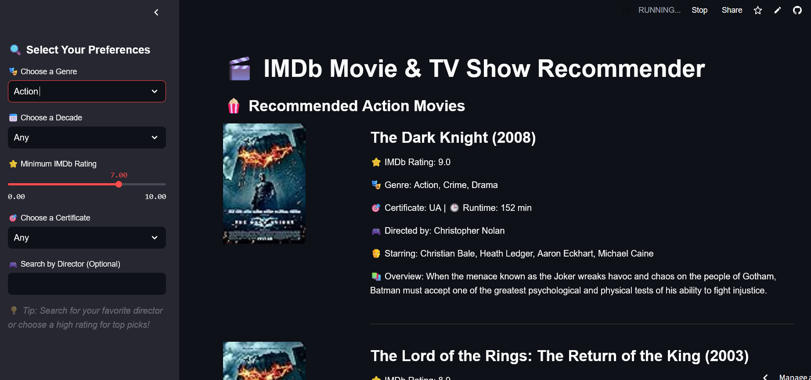

# IMDb Movie Recommender

## Live Demo
Check out the live demo of the project here: [IMDb Movie Recommender](https://imdbmovierecs.streamlit.app/)

## Dataset
This application uses the **IMDb Dataset of Top 1000 Movies and TV Shows**, available on Kaggle: [IMDb Top 1000 Dataset](https://www.kaggle.com/datasets/harshitshankhdhar/imdb-dataset-of-top-1000-movies-and-tv-shows)

## Features
This IMDb Movie Recommender allows users to filter and discover top-rated movies and TV shows based on various criteria. The key features include:

- **Genre Selection:** Choose from a variety of movie genres.
- **Decade Filter:** Browse movies by release decade (e.g., 1990s, 2000s, etc.).
- **IMDb Rating:** Set a minimum IMDb rating for filtering quality movies.
- **MPAA Certificate Filter:** Filter movies based on age ratings (PG, R, etc.).
- **Director Search:** Find movies directed by your favorite filmmakers.
- **Dynamic Recommendations:** Displays personalized recommendations with movie posters.

## How It Works
1. **Select Your Preferences:** Use the sidebar to set filters like genre, decade, rating, and more.
2. **View Recommended Movies:** Movies matching your criteria will be displayed with details and posters.
3. **Refine Your Search:** Adjust filters for a tailored movie discovery experience.

## Notes 
- The quality of the images is unfortunately a bit sh*t. I might try to find a better database on Kaggle or elsewhere that has higher-quality images. 
- I'd like to find a service with a free API that can provide recommendations for where you can watch a particular movie. 
